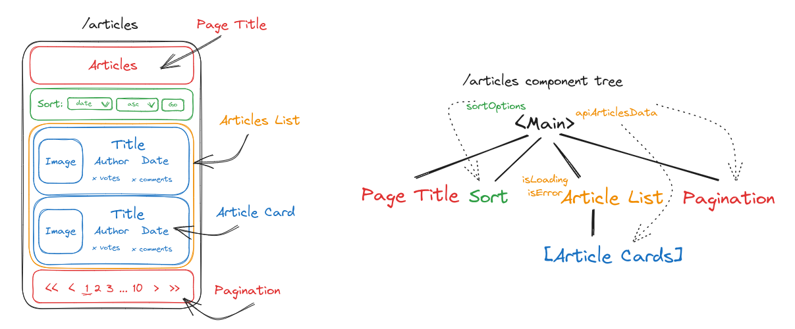
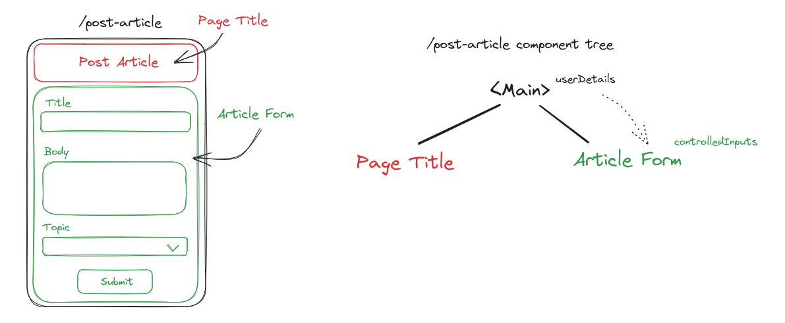

# Planning

- Persistent data
    - user details (hard code this on first page and persist between pages)
        - what articles/comments the user has liked (to prevent then liking it multiple times)
    - view options:
        - how many articles per page
        - dark mode

## Endpoints

- Template for all endpoints
    - Header
        - 'logged in as user' link to user profile

    - Nav bar
        - latest (articles page with default api sorting)
        - search? (would need to modify backend to allow sql to filter by provided title/author etc)
        - browse by topic
        - my profile
        - post an article
        - users

- Articles (show all, sorted by latest first)
    - accept filter (topic) and sort queries
    - option to sort:
        - at top:
            - 'author'
            - 'title'
            - 'topic'
            - 'date'
            - 'votes'
            - 'comments'
            - ascending/descending
        - at bottom:
            - articles per page
            - navigate between pages

- Article
    - article data
    - comments
        - at top:
            - add new comment (textarea and submit button)
        - on each comment:
            - like button
            - link to user profile
        - at bottom:
            - 'load x more comments' button

- Topics
    - links to all articles filtered by topic
    - description
    - how many articles in each topic? (would need to modify backend for topic api endpoint to provide this info)

- Post an article

- Users
    - list of all usernames/avatars

- User?
    - edit avatar/username if profile belongs to user? (would need to modify backend with a PATCH user api)
    - submitted articles? (would need to modify backend to allow sql to filter articles by provided username)
        - delete option if profile belongs to logged in user
            - would need some way of validating user, so that someone who knows the 'delete article' api endpoint can't delete articles
    - recent comments with link to related article? (would need to modify backend to allow sql to filter comments by provided username)

